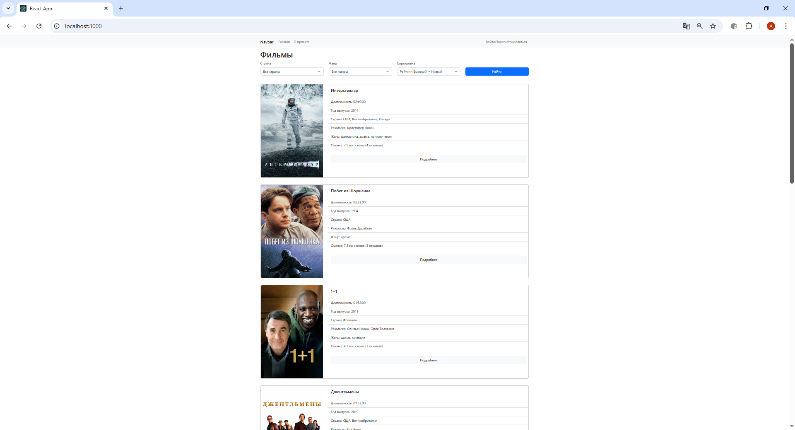
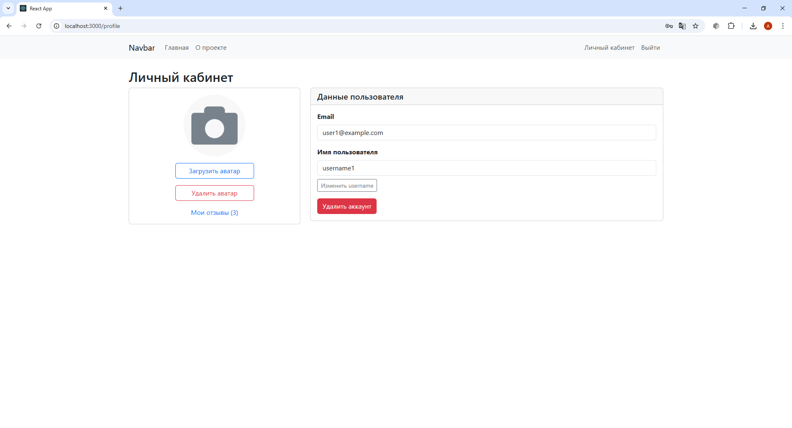
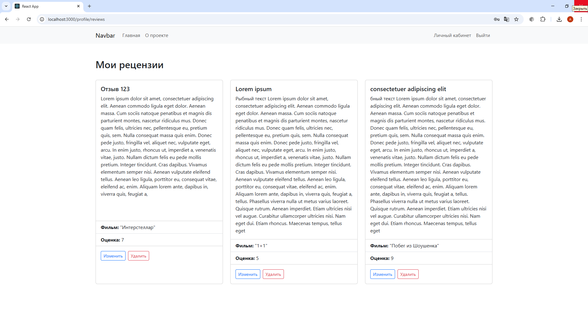
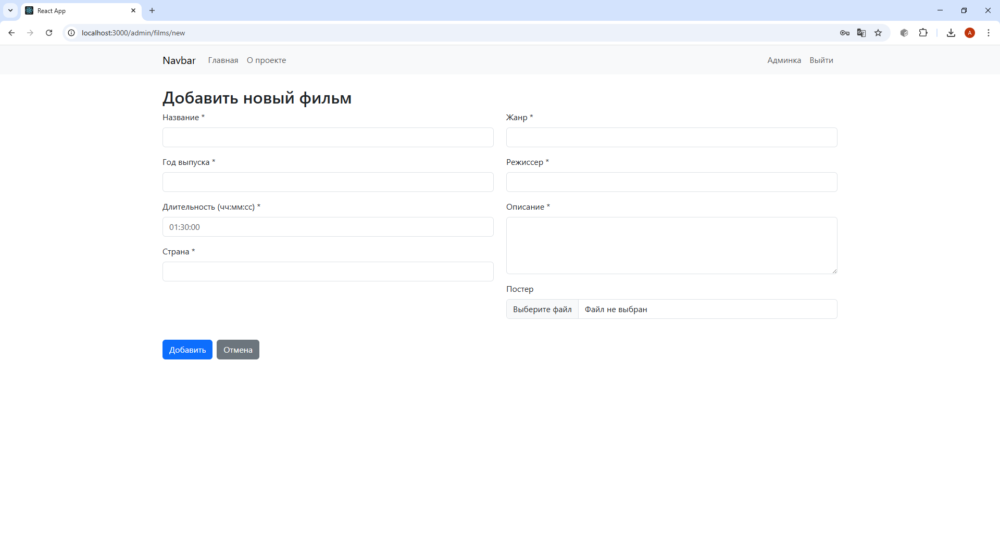
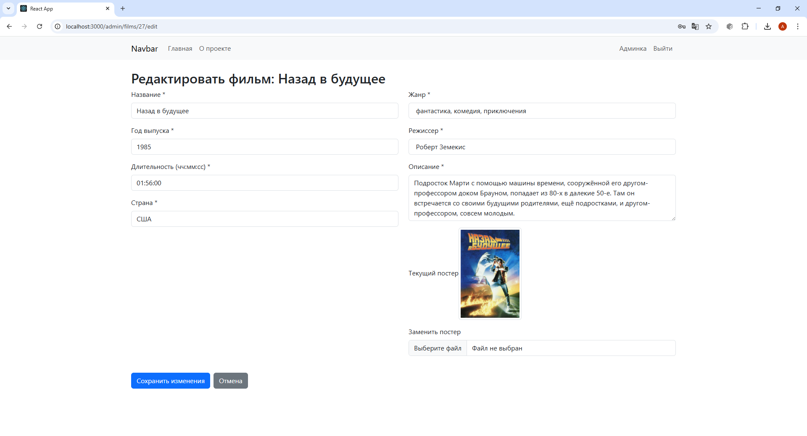
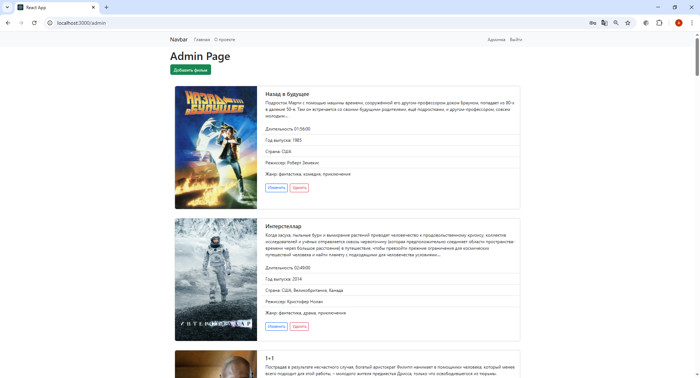

# Filmoteka - Каталог фильмов

Filmoteka - это одностраничное веб-приложение для просмотра, оценки и управления каталогом фильмов. Проект включает как пользовательскую часть (просмотр описания, отзывы), так и админку (управление фильмами).


---
## 🛠 Используемые технологии
### Backend (API):
- **C#, ASP.NET Core 8**
- **Entity Framework Core + Npgsql (PostgreSQL)**
- **ASP.NET Core Identity (управление пользователями и ролями)**
- **JWT Bearer Authentication**
- **Swagger/OpenAPI для документации API**

### Frontend (Клиент):
- **React 18 + Hooks**
- **React Router DOM (клиентская маршрутизация)**
- **Axios для HTTP-запросов**
- **Bootstrap 5 для стилей и компонентов**

### DevOps & Инфраструктура:
- **Docker + Docker Compose**
- **PostgreSQL 17 (в отдельном контейнере)**
- **nginx (как легковесный веб-сервер для React)**
- **Multi-stage сборка (оптимизация размера образов)**

---
## 🌟 Основные функции
### Для всех пользователей:
- **Просмотр списка фильмов с пагинацией**
- **Фильтрация по стране и жанру**
- **Сортировка по году выпуска и среднему рейтингу**
- **Просмотр детальной информации о фильме**
- **Регистрация и вход в систему**
### Для авторизованных пользователей:
- **Добавление отзывов с текстом, заголовком и оценкой (1–10)**
- **Просмотр собственных отзывов**
- **Загрузка аватара (поддерживаемые форматы: JPG, PNG)**
- **Изменение имени пользователя (username)**
- **Удаление аккаунта**
### Для администратора:
- **Полный CRUD для фильмов (создание, редактирование, удаление)**
- **Просмотр всех фильмов в удобной таблице**
- **Доступ к админке только при наличии роли Admin**
### Технические особенности:
- **JWT-аутентификация**
- **Ролевая система (User / Admin)**
- **Автоматическое создание админского аккаунта при первом запуске**
- **Все данные сохраняются между перезапусками контейнеров**
- **SPA-совместимость (работает после перезагрузки любой страницы)**
- **Адаптивный дизайн**

---

## 📸 Скриншоты приложения

* Главная страница


* Страница деталей фильма с отзывами


* Личный кабинет пользователя


* Управление отзывами пользователя


* Страница добавления фильма
 

* Страница редактирования информации о фильме


* Админка


---
## Запуск проекта с помощью Docker
Проект состоит из двух сервисов:

- Client (nginx)
- API (ASP.NET Core 8.0 на порту 7181)
- PostgreSQL 17 (с предзаполненными тестовыми данными)

### Требования
- Docker (установлен и запущен)

### Пошаговая инструкция
1. Клонируйте репозиторий:
```bash
git clone https://github.com/AndreyS27/Filmoteka.git
```
2. Запустите приложение:
```bash
docker-compose up --build
```
3. После запуска:
- Клиент: http://localhost:3000
- API (Swagger): http://localhost:7181/swagger
- База данных автоматически инициализируется из **init.sql**

4. Учётные записи по умолчанию

Администратор:
- Email: admin@example.com
- Пароль: AdminPass123!

Обычный пользователь: зарегистрируйтесь через форму на сайте

!!! При первом запуске может занять 1–2 минуты (сборка образа + инициализация БД).